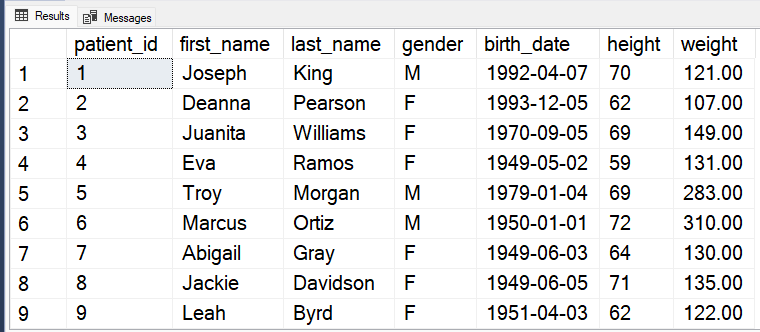
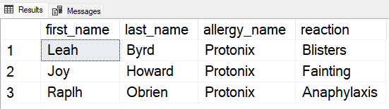
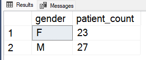
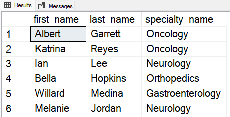
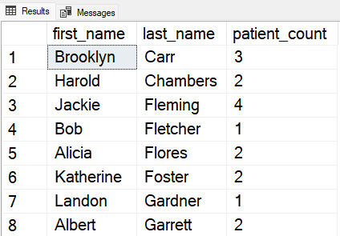
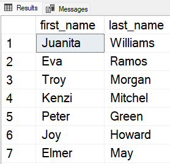

# SQL Server Hospital Database <!-- omit from toc -->

## Table of Contents <!-- omit from toc -->

- [About](#about)
- [Install and Use the Database](#install-and-use-the-database)
  - [Prerequisite](#prerequisite)
  - [Cloning the Repo](#cloning-the-repo)
- [Run Queries](#run-queries)
- [Sample Queries](#sample-queries)

## About

This project was inspired by [sql-practice](https://www.sql-practice.com/), the key difference is that
I added an extra table for doctor specializations, created a table for allergies and a table for patient
allergies with an extra 'reaction' column. This project allows users to install the database and practice
writing SQL queries. It can be used to practice basic select, insert, update, and delete statements. You
can also practice joins, aggregates, subquries, creating views, triggers, functions, and stored procedures.

The data within the tables is completely fictional and does not represent any real person or persons.
The data for the patients and doctors came from [randomuser.me](https://randomuser.me/), a great site
for generating random information for user information. The patient and doctor data in the admissions
table is not meant to represent real data, so the doctors' specialties might not line up with the patients'
diagnosis, as this is meant for mere learning purposes only.

## Install and Use the Database

### Prerequisite

MS SQL Server - You have to download and install [Microsoft SQL Server](https://www.microsoft.com/en-us/sql-server/sql-server-downloads),
once you download it, you can just follow the installation wizard.

SSMS - You have to download and install [SQL Server Management Studio](https://learn.microsoft.com/en-us/sql/ssms/download-sql-server-management-studio-ssms?view=sql-server-ver16). You can follow this [guide](https://learn.microsoft.com/en-us/sql/ssms/quickstarts/ssms-connect-query-sql-server?view=sql-server-ver16) to learn how to connect to a database and how
to use SSMS.

### Cloning the Repo

Once you have MS SQL Server and SSMS installed on you computer, you have to clone this repo to your local machine.

```bash
git clone https://github.com/Manuel7806/sql-server-hospital-database.git
```

After you have cloned the repo open SSMS go `file` -> `open` and select `folder` and then open the cloned folder.
You will have the CSV file along with the script to create and seed the database. Inside the `create.sql`
script there is a variable named `DataSourceLocation`, you can rename that variable to the location of where
you have the cloned repo at or you can move the cloned repo into the same directory as it is in the script.

Once you have either changed the variable or moved the repo, make sure you have SQLCMD mode activated in SSMS.
You can do that by going to `query` and click on `SQLCMD Mode`. After you have enabled SQLCMD mode you can execute
the script and it will create the database objects and insert the data into the tables.

## Run Queries

To run queries against the database, in the object explorer pane right click on the databases folder and select `refresh`,
you should now see the newly created hospital_db database. You can right click on the hospital_db database and select
`New Query`, a new query window will open in the middle of the window, you can write and run your queries from there.


## Sample Queries

List all patients.

```SQL
SELECT * FROM patients
```



---

Find patients with a certain allergen.

```SQL
SELECT
    p.first_name,
    p.last_name,
    a.allergy_name,
    pa.reaction
FROM
    patients AS p
JOIN
    patient_allergies AS pa ON p.patient_id = pa.patient_id
JOIN
    allergies AS a ON pa.allergy_id = a.allergy_id
WHERE
    a.allergy_name = 'Protonix';
```



---

Get the number of patients per gender

```SQL
SELECT
    gender,
    COUNT(*) AS patient_count
FROM
    patients
GROUP BY
    gender;
```



---

List doctors and their specialty

```SQL
SELECT
    d.first_name,
    d.last_name,
    s.specialty_name
FROM
    doctors AS d
JOIN
    specialty AS s ON d.specialty_id = s.specialty_id;
```



---

Get the number of patients admitted per doctor

```SQL
SELECT
    d.first_name,
    d.last_name,
    COUNT(*) AS patient_count
FROM
    doctors AS d
JOIN
    admissions AS a ON d.doctor_id = a.doctor_id
GROUP BY
    d.first_name, d.last_name;
```



---

Get patient names that have been admitted more than once

```SQL
SELECT
    p.first_name,
    p.last_name
FROM
    patients AS p
WHERE
    p.patient_id
IN (
    SELECT
        patient_id
    FROM
        admissions
    GROUP BY
        patient_id
    HAVING
        COUNT(*) > 1
)
```


